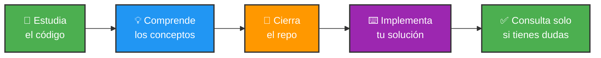

<div align="center">

```
╔══════════════════════════════════════════════════════════════════════╗
║                                                                      ║
║                          📜 LICENCIA ACADÉMICA                       ║
║                                                                      ║
║                             Juego del Gato                           ║
║                                                                      ║
╚══════════════════════════════════════════════════════════════════════╝
```


**Copyright © 2024 Rodrigo Nuñez Garcia**

*Todos los derechos reservados*

</div>

---

## 📚 Información del Proyecto

<table>
<tr>
<td width="50%">

### 🏫 Datos Académicos
```yaml
Institución: Universidad Veracruzana
Curso: Programación
Profesor: Virginia
Período: 2025, 1er semestre
```

</td>
<td width="50%">

### 👥 Autores
```yaml
Desarrollador 1: Rodrigo Nuñez Garcia
Email: 
Desarrollador 2:   
Email:
Desarrollador 3: Rodrigo Nuñez Garcia
Email: 
Desarrollador 4:   
Email:
```

</td>
</tr>
</table>

---

<div align="center">

## ⚖️ TÉRMINOS DE USO

</div>

### ✅ PERMITIDO

<table>
<tr>
<td width="25%" align="center">


**📖 Estudio**

Ver y estudiar el código fuente

</td>
<td width="25%" align="center">


**🔍 Análisis**

Analizar arquitectura y algoritmos

</td>
<td width="25%" align="center">


**🎓 Aprendizaje**

Usar como referencia educativa

</td>
<td width="25%" align="center">


**🔗 Compartir**

Compartir el enlace del repo

</td>
</tr>
</table>

---

### ❌ PROHIBIDO

<table>
<tr>
<td width="25%" align="center">


**📋 Plagio**

Copiar código para entregas

</td>
<td width="25%" align="center">


**💰 Comercial**

Vender o comercializar

</td>
<td width="25%" align="center">


**📦 Redistribuir**

Sin atribución adecuada

</td>
<td width="25%" align="center">


**🔄 Modificar**

Para entrega académica

</td>
</tr>
</table>

---

<div align="center">

## 🎓 PARA ESTUDIANTES

</div>

> ### ⚠️ **ADVERTENCIA IMPORTANTE SOBRE INTEGRIDAD ACADÉMICA**
> 
> Si tienes un proyecto similar, este código debe ser usado **SOLO como referencia para aprender**.

<br>

<div align="center">

### ✅ CÓMO USAR ESTE PROYECTO ÉTICAMENTE

</div>



<br>

### ⛔ CONSECUENCIAS DEL PLAGIO

<table>
<tr>
<td align="center" width="25%">

**📉**

Reprobación de materia

</td>
<td align="center" width="25%">

**⚠️**

Sanciones disciplinarias

</td>
<td align="center" width="25%">

**🚫**

Posible expulsión

</td>
<td align="center" width="25%">

**📋**

Registro permanente

</td>
</tr>
</table>

---

<div align="center">

## 👨‍🏫 PARA PROFESORES

</div>

Los educadores pueden usar este proyecto como:

<table>
<tr>
<td align="center" width="33%">

### 📚 Material de Clase

Ejemplos de buenas prácticas

</td>
<td align="center" width="33%">

### 🔍 Revisión de Código

Sesiones de análisis técnico

</td>
<td align="center" width="33%">

### 📖 Recursos Educativos

Biblioteca de referencias

</td>
</tr>
</table>

**Condición:** Debe hacerse con **atribución adecuada** a los autores.

<br>

> **🔍 Detección de Plagio**
> 
> Este repositorio es público y puede ser usado por herramientas como:
> - Turnitin
> - Moss (Measure of Software Similarity)
> - JPlag
> - Copyleaks

---

<div align="center">

## 📜 CÓMO CITAR ESTE PROYECTO

</div>

<details>
<summary><b>📘 Formato APA</b></summary>

```
Rodrigo Nuñez Garcia. 2024. "Juego del Gato."
[Software de código fuente]. GitHub. 
https://github.com/1213rodri/proyecto-juego-gato
```

</details>

<details>
<summary><b>📗 Formato IEEE</b></summary>

```
Rodrigo Nuñez Garcia. 2024. "Juego del Gato." 
GitHub repository, 2024. [Online]. 
Disponible: https://github.com/1213rodri/proyecto-juego-gato
```

</details>

<details>
<summary><b>📕 Formato Chicago</b></summary>

```
Rodrigo Nuñez Garcia. 2024. "Juego del Gato." 
GitHub. https://github.com/1213rodri/proyecto-juego-gato.
```

</details>

---

<div align="center">

## 🛡️ GARANTÍAS Y RESPONSABILIDAD

</div>

### ⚠️ Descargo de Responsabilidad

<table>
<tr>
<td width="50%">

#### ❌ SIN GARANTÍAS DE:

- Comerciabilidad
- Idoneidad para propósito específico
- No infracción
- Funcionamiento correcto
- Ausencia de errores

</td>
<td width="50%">

#### ⚖️ LIMITACIÓN DE RESPONSABILIDAD:

Los autores **NO son responsables** por:
- Daños directos o indirectos
- Pérdida de datos o beneficios
- Interrupción de actividades
- Cualquier otro daño derivado

</td>
</tr>
</table>

<br>

> ### 🎯 USAS ESTE SOFTWARE BAJO TU PROPIO RIESGO

---

<div align="center">

## 🔒 PRIVACIDAD DE DATOS

</div>

### Guía Web Interactiva con Firebase

<table>
<tr>
<td width="50%" align="center">

#### ✅ SE ALMACENA:

- Nombre de usuario (voluntario)
- Progreso en tareas

</td>
<td width="50%" align="center">

#### ❌ NO SE RECOPILA:

- Datos personales sensibles
- Información de contacto
- Datos de ubicación
- Info del dispositivo

</td>
</tr>
</table>

> **🔐 Todos los datos son anónimos** y se usan únicamente para funcionalidad de progreso.

---

<div align="center">

## 🤝 CONTRIBUCIONES

</div>

```diff
! Este es un PROYECTO ACADÉMICO CERRADO
- No se aceptan Pull Requests externos
- No se aceptan Issues de funcionalidades
+ Solo los autores pueden hacer modificaciones
+ Se aceptan reportes de errores críticos
```

---

<div align="center">

## 📞 CONTACTO

</div>

<table align="center">
<tr>
<td align="center">

### 📧 Email

[roxdnunez@gmail.com](mailto:roxdnunez@gmail.com)

</td>
<td align="center">

### 🐙 GitHub

[@1213rodri](https://github.com/1213rodri)

</td>
<td align="center">

### ⏱️ Respuesta

24-48 horas

</td>
</tr>
</table>

---

<div align="center">

## 📅 CONTROL DE VERSIONES

</div>

| Versión | Fecha | Cambios |
|:-------:|:-----:|:-------:|
|  | 22/11/25 | Licencia inicial del proyecto |

---

<div align="center">

## 🌐 JURISDICCIÓN LEGAL

</div>

> Esta licencia se rige por las leyes de **Mexico, Veracruz**  
> Disputas se resolverán en tribunales de **Xalapa, Veracruz**

---

<br>

<div align="center">

```
╔════════════════════════════════════════════════════════════╗
║                                                            ║
║                      ✍️ FIRMADO POR                        ║
║                                                            ║
║    👤 Rodrigo                                              ║
║                                                            ║
║    📅 Fecha: 22/11/25                                      ║
║    📋 Versión de Licencia: 1.0                             ║
║    ✅ Estado: Activo                                       ║
║                                                            ║
╚════════════════════════════════════════════════════════════╝
```

<br>

---

### 💙 Proyecto desarrollado con fines académicos

**© 2024 Rodrigo NUñez Garcia**

*Todos los derechos reservados*

---

<br>

### 🔐 Mensaje de Integridad Académica

```
╭──────────────────────────────────────────────────────────╮
│                                                          │
│  "El conocimiento se construye sobre bases honestas.    │
│   Aprende, comprende, y crea tu propio camino."         │
│                                                          │
│              - Comunidad de Desarrolladores              │
│                                                          │
╰──────────────────────────────────────────────────────────╯
```

<br>

---

### 📚 Recursos sobre Integridad Académica

[](https://www.ieee.org/about/corporate/governance/p7-8.html)
[](https://www.acm.org/code-of-ethics)
[](https://www.plagiarism.org/)

<br>

---

<br>

**📄 Última actualización:** 22/11/25  
**🔖 Versión de documento:** 1.0  
**✅ Estado:** Activo y Vigente

<br>

[](#)

</div>
