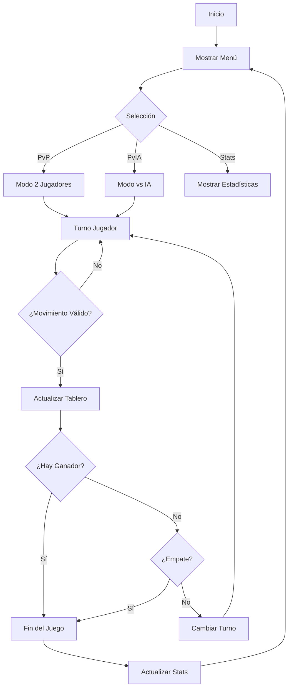

<div align="center">

# 🎮 Juego del Gato 

### *Implementación inteligente del clásico juego con IA avanzada*

[](https://isocpp.org/)
[](https://firebase.google.com/)
[](LICENSE)
[](https://github.com)

  

[📖 Documentación](docs/) · [🐛 Reportar Bug](../../issues) · [✨ Solicitar Feature](../../issues)

</div>

---

## 📑 Tabla de Contenidos

- [🎯 Características](#-características)
- [🚀 Demo](#-demo)
- [⚙️ Instalación](#️-instalación)
- [🎮 Uso](#-uso)
- [🏗️ Arquitectura](#️-arquitectura)
- [🤖 Inteligencia Artificial](#-inteligencia-artificial)
- [🌐 Guía Web Interactiva](#-guía-web-interactiva)
- [👥 Colaboración](#-colaboración)
- [📊 Evaluación](#-evaluación)
- [🛠️ Tecnologías](#️-tecnologías)
- [📝 Licencia](#-licencia)

---

## 🎯 Características

<table>
<tr>
<td width="50%">

### 🎲 Modos de Juego
- **👥 PvP**: Multijugador local
- **🤖 PvIA Easy**: IA con movimientos aleatorios
- **🧠 PvIA Hard**: IA estratégica avanzada
- **📊 Estadísticas**: Historial de partidas

</td>
<td width="50%">

### 💎 Características Técnicas
- ✅ Validación robusta de entradas
- 🎨 Interfaz de consola intuitiva
- 🔄 Sistema de reinicio rápido
- 💾 Persistencia de datos

</td>
</tr>
</table>

### 🌟 Highlights

```cpp
✨ Código modular y bien documentado
🧪 Validaciones exhaustivas de entrada
🎯 IA con algoritmo minimax simplificado
🔥 Sistema de estadísticas en tiempo real
🌐 Guía interactiva sincronizada en la nube
```

---

## 🚀 Demo

### Vista del Juego

```
╔════════════════════════════════════╗
║     🎮 JUEGO DEL GATO 🎮          ║
╚════════════════════════════════════╝

       1   2   3
    A     |   | X 
       ---|---|---
    B   O | X |   
       ---|---|---
    C     | O | X 

Turno de: Jugador 1 (X)
Ingresa tu jugada (ej: A1): _
```

---

## ⚙️ Instalación

### 📋 Requisitos Previos

| Componente | Versión Mínima | Enlace |
|------------|---------------|--------|
| C++ Compiler | GCC 7.0+ / MSVC 2017+ | [Descargar](https://gcc.gnu.org/) |
| Git | 2.0+ | [Descargar](https://git-scm.com/) |
| Navegador Web | Moderno (Chrome, Firefox) | - |

### 🔽 Descarga

```bash
# Clonar repositorio
git clone https://github.com/TU_USUARIO/proyecto-juego-gato.git

# Navegar al directorio
cd proyecto-juego-gato
```

### 🔨 Compilación

<details>
<summary><b>🐧 Linux / macOS</b></summary>

```bash
# Compilar
g++ -std=c++11 -Wall -O2 src/*.cpp -o juego_gato

# Ejecutar
./juego_gato
```
</details>

<details>
<summary><b>🪟 Windows (MinGW)</b></summary>

```bash
# Compilar
g++ -std=c++11 -Wall -O2 src/*.cpp -o juego_gato.exe

# Ejecutar
juego_gato.exe
```
</details>

<details>
<summary><b>🎨 Visual Studio</b></summary>

1. Abrir Visual Studio
2. `Archivo` → `Abrir` → `Carpeta`
3. Seleccionar carpeta del proyecto
4. Presionar `F5` para compilar y ejecutar
</details>

---

## 🎮 Uso

### Menú Principal

| Opción | Descripción |
|--------|-------------|
| `1` | 👥 Jugador vs Jugador |
| `2` | 🤖 Jugador vs Computadora |
| `3` | 📖 Ver Instrucciones |
| `4` | 📊 Ver Estadísticas |
| `5` | 🚪 Salir |

### Controles del Juego

```
Formato de entrada: [Fila][Columna]
Ejemplo: A1, B2, C3

Filas: A, B, C
Columnas: 1, 2, 3
```

### Ejemplos de Jugadas

```cpp
// Jugadas válidas
A1  // Esquina superior izquierda
B2  // Centro del tablero
C3  // Esquina inferior derecha

// Jugadas inválidas
D1  // ❌ Fila fuera de rango
A4  // ❌ Columna fuera de rango
B2  // ❌ Casilla ocupada
```

---

## 🏗️ Arquitectura

### 📂 Estructura del Proyecto

```
proyecto-juego-gato/
│
├── 📁 src/                     # Código fuente
│   ├── main.cpp                # Punto de entrada
│   ├── tablero.cpp             # Lógica del tablero
│   ├── ia.cpp                  # Inteligencia artificial
│   ├── validaciones.cpp        # Validación de datos
│   └── estadisticas.cpp        # Sistema de stats
│
├── 📁 include/                 # Headers (.h)
│   ├── tablero.h
│   ├── ia.h
│   ├── validaciones.h
│   └── estadisticas.h
│
├── 📁 docs/                    # Documentación
│   └── index.html              # Guía web interactiva
│
├── 📁 assets/                  # Recursos
│   └── diagrama-flujo.png
│
├── .gitignore
├── README.md
└── LICENSE
```

### 🔄 Flujo de Datos



---

## 🤖 Inteligencia Artificial

### 🎯 IA Fácil - Estrategia Aleatoria

```cpp
Algoritmo:
1. Obtener todas las casillas vacías
2. Seleccionar una aleatoriamente
3. Realizar movimiento

Complejidad: O(n)
Dificultad: ⭐☆☆☆☆
```

### 🧠 IA Difícil - Estrategia Avanzada

```cpp
Algoritmo de Decisión:
1. 🏆 Intentar ganar (buscar 2 en línea propias)
2. 🛡️ Bloquear oponente (buscar 2 en línea del rival)
3. 🎯 Tomar centro si está disponible
4. 📐 Ocupar esquinas estratégicas
5. 🎲 Movimiento aleatorio en caso contrario

Complejidad: O(n²)
Dificultad: ⭐⭐⭐⭐☆
```

### 📊 Comparativa de IAs

| Característica | IA Fácil | IA Difícil |
|---------------|----------|------------|
| **Estrategia** | Aleatoria | Heurística |
| **Tiempo de respuesta** | Instantáneo | < 0.1s |
| **Tasa de victoria** | ~20% | ~80% |
| **Nivel** | Principiante | Avanzado |

---

## 🌐 Guía Web Interactiva

### ✨ Características

<table>
<tr>
<td width="33%" align="center">

### ☁️ Cloud Sync
Sincronización automática con Firebase Firestore

</td>
<td width="33%" align="center">

### ✅ Progreso
28 tareas interactivas con seguimiento

</td>
<td width="33%" align="center">

### 📱 Multi-device
Acceso desde cualquier computadora

</td>

<td width="33%" align="center">

### Siti oWeb:

https://sistema-de-progreso-proyecto.vercel.app/

</td>

</tr>
</table>


### 📚 Contenido de la Guía

- 📋 Introducción al proyecto
- 🏗️ Estructura del programa
- ✅ Checklist de 28 tareas
- 📦 Implementación de structs
- 🎯 Lógica del tablero
- 🏆 Verificación de ganador
- 🤖 Algoritmos de IA
- 📱 Sistema de menús
- ✔️ Validaciones
- ⚠️ Errores comunes
- 📊 Rúbrica de evaluación

---

## 👥 Colaboración

### 🔀 Flujo de Trabajo con Git

```bash
# 1️⃣ Antes de trabajar
git pull origin main

# 2️⃣ Hacer cambios en el código...

# 3️⃣ Guardar cambios
git add .
git commit -m "feat: descripción clara del cambio"
git push origin main
```

### 📋 Convenciones de Commits

| Tipo | Descripción | Ejemplo |
|------|-------------|---------|
| `feat` | Nueva característica | `feat: agregar IA difícil` |
| `fix` | Corrección de bug | `fix: validación de entrada` |
| `docs` | Documentación | `docs: actualizar README` |
| `style` | Formato de código | `style: identación en main.cpp` |
| `refactor` | Refactorización | `refactor: optimizar verificarGanador()` |
| `test` | Pruebas | `test: agregar casos de prueba` |

### 👨‍💻 División de Tareas Sugerida

<table>
<tr>
<td width="50%">

#### Desarrollador 1
- ✅ `main.cpp` - Función principal
- ✅ `tablero.cpp` - Lógica del tablero
- ✅ Documentación del código
- ✅ Testing de funciones básicas

</td>
<td width="50%">

#### Desarrollador 2
- ✅ `ia.cpp` - Inteligencia artificial
- ✅ `validaciones.cpp` - Validaciones
- ✅ `estadisticas.cpp` - Sistema de stats
- ✅ Debugging y optimización

</td>
</tr>
</table>

---

## 📊 Evaluación

### 🎯 Rúbrica (20 puntos totales)

| Criterio | Puntos | Descripción |
|----------|--------|-------------|
| 📐 **Tablero 3x3** | 2 | Matriz correctamente implementada y visualizada |
| 📦 **Structs** | 3 | Jugador y Estadísticas bien estructurados |
| 🏆 **Verificar Ganador** | 3 | Detecta correctamente filas, columnas y diagonales |
| 👥 **Modo PvP** | 2 | Modo jugador vs jugador funcional |
| 🎲 **IA Fácil** | 2 | Movimientos aleatorios válidos |
| 🧠 **IA Difícil** | 3 | Algoritmo estratégico completo y efectivo |
| ✅ **Validaciones** | 2 | Validación robusta de entradas y movimientos |
| 🎨 **Menús y UX** | 2 | Sistema de menús intuitivo e instrucciones claras |
| 📝 **Código Limpio** | 1 | Organización, comentarios y buenas prácticas |

### ✅ Checklist de Entrega

- [ ] ✔️ El código compila sin errores ni warnings
- [ ] ✔️ Todos los modos de juego funcionan correctamente
- [ ] ✔️ Las validaciones previenen todos los errores posibles
- [ ] ✔️ La IA difícil es competitiva (>70% tasa de victoria)
- [ ] ✔️ El código está bien comentado y documentado
- [ ] ✔️ El README está completo y actualizado
- [ ] ✔️ La guía web funciona con Firebase
- [ ] ✔️ El repositorio está limpio (sin .exe, .o, .obj)
- [ ] ✔️ Se incluye diagrama de flujo actualizado
- [ ] ✔️ La documentación técnica está completa
- [ ] ✔️ Las pruebas están documentadas
- [ ] ✔️ El código sigue estándares de C++11

---

## 🛠️ Tecnologías

### Backend (C++)


```cpp
// Librerías utilizadas
#include <iostream>   // I/O streams
#include <cstdlib>    // Funciones aleatorias
#include <ctime>      // Semilla para rand()
#include <string>     // Manejo de cadenas
#include <vector>     // Contenedores dinámicos
```

### Frontend (Guía Web)


### Herramientas


---

## 🐛 Troubleshooting

<details>
<summary><b>❌ Error: "No se reconoce g++ como comando"</b></summary>

**Solución:**
- **Windows**: Instala [MinGW](http://www.mingw.org/) o [MSYS2](https://www.msys2.org/)
- **Linux**: `sudo apt install build-essential`
- **macOS**: `xcode-select --install`

</details>

<details>
<summary><b>🔥 Error: "Firebase not configured"</b></summary>

**Solución:**
1. Verifica las credenciales en `docs/index.html`
2. Asegúrate de haber creado el proyecto en Firebase Console
3. Confirma que Firestore esté habilitado

</details>

<details>
<summary><b>🔒 Error: "Permission denied" en Firebase</b></summary>

**Solución:**
Configura las reglas de Firestore en modo de prueba:
```javascript
allow read, write: if true;
```

</details>

<details>
<summary><b>⚠️ Conflictos en Git</b></summary>

**Solución:**
```bash
# Descargar cambios remotos
git pull

# Resolver conflictos manualmente (busca <<<<<<< HEAD)
# Editar archivos y eliminar marcadores

# Guardar resolución
git add .
git commit -m "fix: resolver conflictos de merge"
git push
```

</details>

---

## 📚 Recursos Adicionales

### 📖 Documentación

- [Documentación de C++](https://en.cppreference.com/)
- [Firebase Firestore](https://firebase.google.com/docs/firestore)
- [Git Book](https://git-scm.com/book/es/v2)
- [Markdown Guide](https://www.markdownguide.org/)

### 🎓 Tutoriales

- [Learn C++](https://www.learncpp.com/)
- [Firebase Tutorial](https://firebase.google.com/docs/web/setup)
- [Git & GitHub para Principiantes](https://www.youtube.com/watch?v=HiXLkL42tMU)

### 🔧 Herramientas Útiles

- [Compiler Explorer](https://godbolt.org/) - Compilador online
- [Firebase Console](https://console.firebase.google.com/)
- [GitHub Desktop](https://desktop.github.com/)

---

## 📝 Licencia

Este proyecto fue desarrollado con fines **educativos** para el curso de Programación.

```
📚 Institución:  Universidad Veracruzana (Facultad de Estadistica e Indormatica) 
🎓 Curso: Programación /  Introduccion a la Programación
👨‍🏫 Profesor: LAGUNES BARRADAS, VIRGINIA
📅 Semestre: 1er semestre 2025
```

---

## 👥 Equipo

<table>
<tr>
       
<td align="center">
<br />
<sub><b>Desarrollador 1</b></sub><br />
<a href="mailto:tu.email@ejemplo.com">📧 Email</a>
</td>

<td align="center">
<br />
<sub><b>Desarrollador 2</b></sub><br />
<a href="mailto:email@ejemplo.com">📧 Email</a>
</td>

<td align="center">
<br />
<sub><b>Desarrollador 3</b></sub><br />
<a href="mailto:email@ejemplo.com">📧 Email</a>
</td>

<td align="center">
<br />
<sub><b>Desarrollador 4</b></sub><br />
<a href="mailto:email@ejemplo.com">📧 Email</a>
</td>

</tr>
</table>

---

## 🙏 Agradecimientos

- 👨‍🏫 **Profesor LAGUNES BARRADAS, VIRGINIA** - Por la guía y enseñanza
- 👥 **Compañeros de clase** - Por el apoyo constante
- 📚 **Comunidad de C++** - Por la documentación

---

## 📈 Estadísticas del Proyecto


---

## 📅 Historial de Versiones

### v2.0.0 - Web Integration (Current)
- ✅ Guía interactiva web completa
- ✅ Integración con Firebase Firestore
- ✅ Sistema de progreso sincronizado
- ✅ Documentación profesional

### v1.2.0 - Advanced AI
- ✅ IA difícil con estrategia avanzada
- ✅ Sistema de estadísticas mejorado
- ✅ Optimización de algoritmos

### v1.1.0 - Basic AI
- ✅ IA fácil implementada
- ✅ Sistema de validaciones completo
- ✅ Mejoras en la interfaz

### v1.0.0 - Initial Release
- ✅ Implementación inicial del tablero
- ✅ Modo jugador vs jugador
- ✅ Verificación de ganador básica

---

<div align="center">

### 💖 ¿Te gustó el proyecto?

Si este proyecto te fue útil, considera darle una ⭐

[](https://github.com/TU_USUARIO/proyecto-juego-gato/stargazers)
[](https://github.com/TU_USUARIO/proyecto-juego-gato/network/members)

---

**Hecho con ❤️ y ☕ por MENDEZ CRUZ DIEGO ALBERTO, NUÑEZ GARCIA RODRIGO , RODRIGUEZ DOMINGUEZ JACQUELINE, RONZON RONZON PALOMA DE JESUs**

© 2024 Proyecto Juego del Gato. Todos los derechos reservados.

</div>
